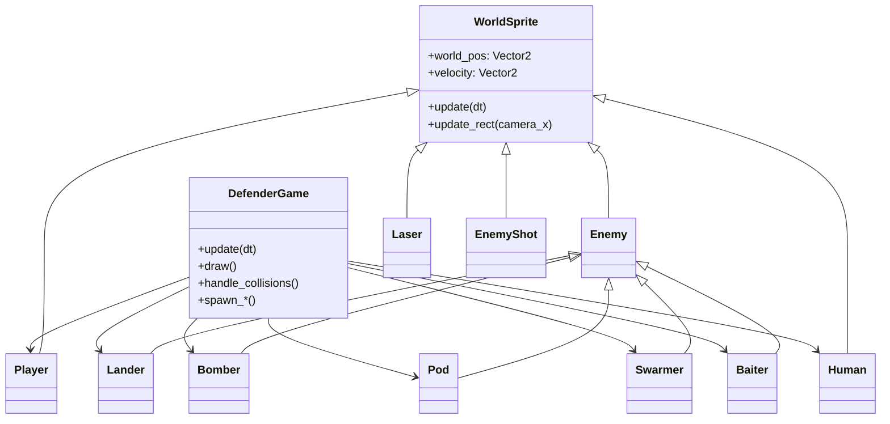
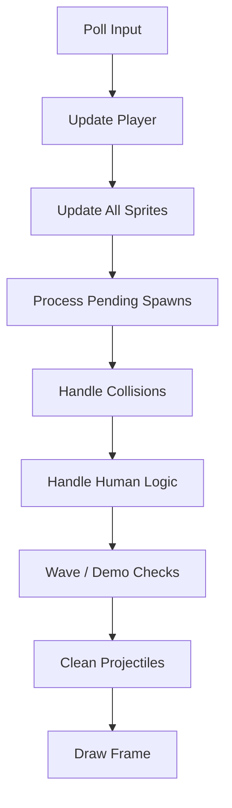
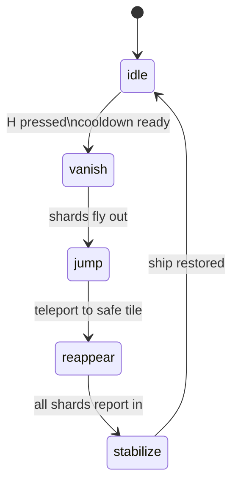

# Defender (Python/Pygame)

## Overview

**Defender** is a modern Python/Pygame reimagining of the 1981 Williams arcade classic.  
You pilot a nimble starfighter across a scrolling planet, rescuing colonists while fending off an escalating alien armada. The project is contained in a single `defender.py` module and focuses on expressive sprite work, synthesised sound effects, and faithful gameplay pacing.

## How To Play

| Action | Key |
| --- | --- |
| Move | `WASD` or Arrow keys |
| Fire laser | `Space` |
| Reverse direction | `Shift` |
| Hyperspace | `H` |
| Smart Bomb | `B` |
| Toggle no-death (debug) | `0` |

Rescue falling colonists by catching them, then land them gently. Protect them from landers and the mutants they become when abducted.

## Systems Architecture

Everything lives in a single, well-commented `defender.py` module. Despite being monolithic, responsibilities are clearly separated:

- `SoundManager` procedurally synthesises every effect at start-up.
- `WorldSprite` gives every entity a wrapped world position and a predictable `update_rect` path.
- `Player` handles input, shooting, scoring, and the cinematic hyperspace state machine.
- Enemy classes inherit from `Enemy` but supply their own movement and behaviours.
- `DefenderGame` is the conductor: it owns the sprite groups, main loop, HUD, demo mode, and all spawning logic.



### Update Loop

Each frame the game executes a deterministic loop: input → simulation → collision → rendering. This flow handles delays (like hyperspace and respawn timers), scheduled spawns, and wave progression.



### Hyperspace Sequence



- **Vanish:** The ship records its direction, camera lead, velocity, and throttle state; eight shards sprint toward the screen edge and the sprite becomes invisible.
- **Jump:** While invisible, control is locked, velocity is zeroed, and a new location is chosen.
- **Reappear:** Inbound shards sprint to the destination. Each shard calls `Player.notify_inbound_shard_complete()` on death so the ship knows when it is safe to reappear.
- **Stabilise:** Once the shard counter hits zero the ship pops back in with the original direction, velocity, throttle state, and camera lead.

The implementation is heavily annotated inside `Player.update_hyperspace` and `DefenderGame.spawn_hyperspace_shards`.

### Entities At A Glance

| Entity | Behaviour | Notes |
| --- | --- | --- |
| `Lander` | Abducts colonists and mutates into mutants | Tracks reserved colonists so only one lander targets them. |
| `Bomber` | Drifts and drops mines | Mines persist in the projectile group. |
| `Pod` | Breaks into swarmers | Swarmers inherit the player seeking routine. |
| `Swarmer` | Kamikaze drone | Applies jitter to stop perfect lines. |
| `Baiter` | Pressure ship | Spawns if the player takes too long. |
| `Human` | Colonists | Handle abduction, falling, safe landing, craters, scoring. |
| `Laser` / `EnemyShot` | Projectiles | Only damage what is currently visible on-screen. |

## Hyperspace Sequence

See above for the state diagram; the shard animation is symmetrical and fully reversible.

## Lives & Scoring

- The player starts with three ships (current ship + two reserves).  
- Extra ships are awarded every 10,000 points up to a maximum of five reserves.  
- On death the ship explodes, shards respawn after a 2‑second delay, and the player gains a temporary invulnerability shield.

## Demo Mode (Attract)

After 15 seconds of inactivity, the game enters a non-lethal demo loop showcasing:

1. A lander abducting a colonist.  
2. The player destroying the lander, catching the colonist, and delivering them.  
3. Allowing a second abduction to complete so a mutant spawns.

Press `Enter` at any time to exit demo mode and start a real game.

## Developer Notes

- **Sound pipeline:** everything is generated procedurally by `SoundManager`; no binary assets are required.
- **Collision filtering:** only visible sprites can be damaged, preventing off-screen kills and ensuring hyperspace chunks do not explode early.
- **Attract mode:** the demo loop uses the same public APIs as real gameplay—changes automatically propagate.
- **Docstrings:** the entire source is annotated so tooling like `pydoc` or IDE inspectors can surface the intended behaviour quickly.

## Building & Running

```bash
pip install pygame
python3 defender.py
```

Dependencies:
- Python ≥ 3.9
- `pygame` (the script attempts to initialise audio but falls back gracefully if unavailable)

## Code Commentary

- **Player control & hyperspace** live in the `Player` class.  
- **Enemies** inherit common movement and firing behaviour from `Enemy`, then specialise (`Lander`, `Pod`, `Bomber`, etc.).  
- **HUD** and **terrain** rendering are in dedicated helper methods within `DefenderGame`.  
- **Sound** uses a miniature synthesizer (`SoundManager`) that builds classic Defender-style effects procedurally.

## Contributing

Feel free to fork and iterate. Ideas:
- Add wave variety or bonus rounds.
- Introduce online scoreboards.
- Port the demo attract sequence to a scripted cutscene using external data.

## Testing & Debugging Tips

- Run `python3 -m compileall defender.py` to catch syntax errors fast.
- Toggle invulnerability with `0` while tuning enemy logic.
- The `demo_active` flag can be forced to `True` at start-up if you want to
  profile or capture the attract loop without touching the keyboard.

## Extending The Game

- Drop in additional enemy classes by inheriting from `Enemy` and registering them via `spawn_wave_enemies`.
- Swap the procedural art for sprite sheets by replacing the helper functions at the top of the file.
- Export the HUD to a separate module if you plan to support multiple resolutions.
